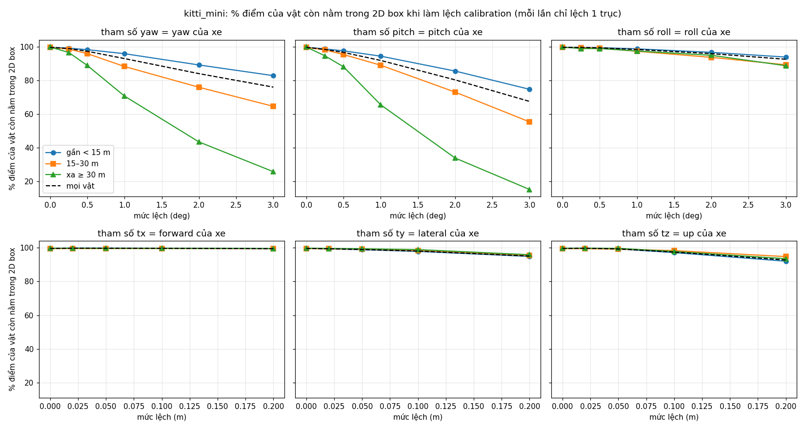
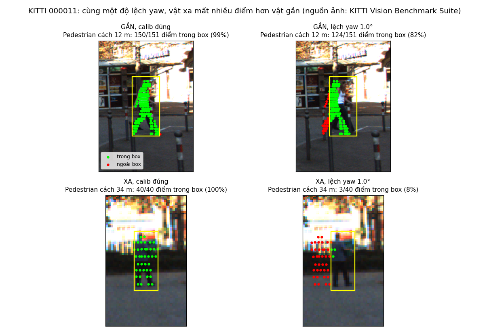
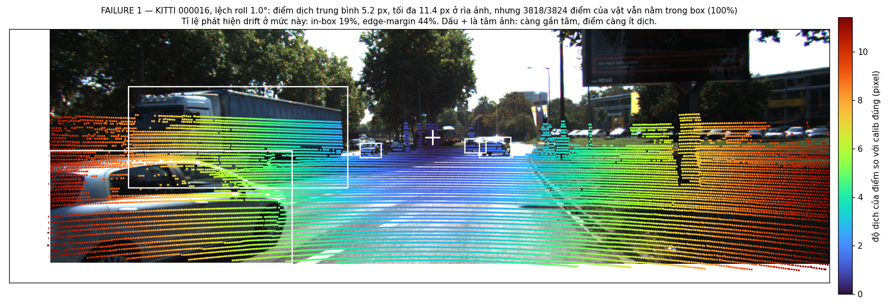
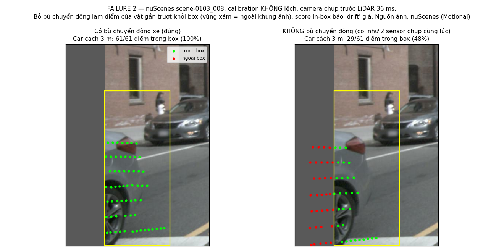

# Báo cáo Day 6: Kiểm tra calibration LiDAR-camera bằng projection

- **Họ tên:** Nguyễn Trần Kiên
- **MSSV:** 2A202602571 (phải trùng với MSSV trong tên repo `<HoVaTen>-<MSSV>-Track4-Day21`)
- **Lớp:** AI20K Khoá 4 (K4), Track 4: Computer Vision and Robotics
- **Link repo:** https://github.com/picuisme/NguyenTranKien-2A202602571-Track4-Day21
- **Topic:** A — LiDAR-camera projection QA
- **Dataset:** data/kitti_mini (thí nghiệm chính), data/nuscenes_mini_subset (so sánh và failure về thời gian), data/synthetic (debug code và rà lỗi cài sẵn)
- **Các frame đã dùng:** cả 20 frame kitti_mini (000001 … 000061), cả 80 frame nuScenes (scene-0103_000 … scene-1094_039), 5 frame synthetic. Ảnh minh hoạ: 000011, 000016, scene-0103_008, scene-0103_010

## 1. Claim

Trên kitti_mini (20 frame, 107 vật có ≥ 10 điểm LiDAR), **lệch yaw 1° làm vật ở xa (≥ 30 m) mất 29 điểm phần trăm số điểm LiDAR nằm trong 2D box của nó (99.7% → 70.6%), trong khi vật gần (< 15 m) chỉ mất 3.8 điểm phần trăm (99.6% → 95.8%)**. Một bộ giám sát nhìn 10 frame, báo động giả 1%, phát hiện được lệch yaw và pitch từ 0.5° (in-box ratio: 99–100% số cửa sổ; edge-margin không cần label: 96% với yaw). Nhưng cả hai score **không phát hiện được lệch roll ≤ 1° và dịch dọc trục tiến tới 20 cm**.

Claim nháp ở CP1 ("yaw 1° làm vật xa mất hơn 10%, vật gần mất dưới 5%") được số liệu xác nhận. Phần về roll và dịch dọc không có trong claim nháp, được bổ sung sau thí nghiệm ở CP3.

## 2. Evidence

**Bảng chính, kitti_mini, chỉ thay đổi yaw** (`results/calib_perturb_sweep_kitti_mini.csv`, `results/drift_detection.csv`):

| Lệch yaw | Điểm dịch trung bình | % điểm trong ảnh (FOV) | % điểm trong 2D box, mọi vật | Vật gần < 15 m | Vật xa ≥ 30 m | Phát hiện bằng in-box | Phát hiện bằng edge-margin |
|---|---|---|---|---|---|---|---|
| 0° (calib gốc) | 0 px | 15.75% | 99.6% | 99.6% | 99.7% | 1% (báo động giả) | 1% (báo động giả) |
| 0.5° | 7.7 px | 15.76% | 97.2% | 98.2% | 88.8% | 99% | 96% |
| 1° | 15.5 px | 15.76% | 92.9% | 95.8% | 70.6% | 100% | 100% |
| 2° | 31.0 px | 15.77% | 84.0% | 89.1% | 43.5% | 100% | 100% |
| 3° | 46.5 px | 15.77% | 76.0% | 82.8% | 25.8% | 100% | 100% |

"% điểm trong ảnh" gần như không đổi, nên không dùng nó để bắt drift được. Lý do vật xa mất nhiều hơn: yaw 1° dịch mọi điểm cùng khoảng 15 px, còn box của vật xa chỉ rộng vài chục pixel. Đủ 6 trục (yaw, pitch, roll, 3 hướng tịnh tiến), mỗi trục 4–5 mức, nằm trong cùng file CSV và hình dưới.




Ảnh overlay ở 3 khoảng cách (calib gốc): [gần](../results/figures/overlay_000011_near_0_15m.png), [giữa](../results/figures/overlay_000011_mid_15_30m.png), [xa](../results/figures/overlay_000011_far_30m_plus.png). Cùng 3 ảnh khi lệch yaw 1° có đuôi `_y1.0_` trong `results/figures/`.

**So sánh 2 score trên cùng dữ liệu** (mức lệch nhỏ nhất bị phát hiện ở ≥ 90% số cửa sổ 10 frame; ngưỡng là phân vị 1% khi calib đúng: in-box < 97.6%, edge-margin < 0.018 trên KITTI). Hình: `results/figures/score_vs_perturb.png`, `results/figures/detect_rate_vs_perturb.png`.

| Score | yaw | pitch | roll | dịch ngang | dịch cao | dịch dọc (tiến) | Ưu điểm | Nhược điểm |
|---|---|---|---|---|---|---|---|---|
| In-box ratio (KITTI) | 0.5° | 0.5° | 2° | 20 cm | 20 cm | không (1% ở 20 cm) | nhạy, rẻ (p50 3.8 ms) | cần 2D box và điểm của từng vật |
| Edge-margin (KITTI) | 0.5° | 1° | 2° | 20 cm | không đạt 90% (89% ở 20 cm) | không (6% ở 20 cm) | không cần label | kém nhạy hơn, tốn hơn (p50 khoảng 23 ms cho 3 bước) |
| In-box ratio (nuScenes) | 0.25° | 1° | 2° | 5 cm | 20 cm | không (16% ở 20 cm) | như trên | 2D box ở đây suy từ 3D box nên ngưỡng 99.85% là lạc quan |
| Edge-margin (nuScenes) | chỉ 1° (92%), tụt còn 60% ở 2–3° | không | không | không | không | không | như trên | LiDAR 32 beam cho quá ít điểm mép |

**Hai dataset** (`results/calib_perturb_sweep_nuscenes_mini_subset.csv`): cùng lệch yaw 1°, nuScenes dịch 26.0 px (tiêu cự 1266 px) so với 15.5 px của KITTI (721 px), nhưng vật xa chỉ tụt còn 93.3% thay vì 70.6%. Nguyên nhân: 2D box của nuScenes là hình chiếu của 3D box nên rộng hơn box vẽ sát của KITTI, và ảnh 1600×900 làm vật to hơn tính theo pixel. Edge-margin yếu hẳn trên nuScenes vì 32 beam chỉ cho khoảng 35 nghìn điểm mỗi frame (KITTI khoảng 120 nghìn). Trục LiDAR hai bên đặt khác nhau, nên cột `vehicle_axis` trong CSV quy mọi tham số về trục của xe trước khi so sánh.

**Latency** (`results/latency_*.csv`; Intel Core i7-12650H, máy ảo Linux 2 nhân, không GPU; bỏ lần chạy đầu, 30 lần lặp; frame KITTI 000001, 120 nghìn điểm): chiếu toàn bộ điểm p50 17.4 ms / p95 19.6 ms; in-box 3.8 / 5.4 ms; edge-margin gồm tìm mép độ sâu 8.4 / 10.9 ms, Canny 5.5 / 6.4 ms, 7 lần chấm 9.4 / 11.1 ms.

**Lỗi cài sẵn trong data/synthetic** (`results/synthetic_audit.csv`, `results/figures/synthetic_audit.png`). Tôi tìm được 3 lỗi dưới đây và không khẳng định đã hết:

| Lỗi | Frame | Cách phát hiện |
|---|---|---|
| Điểm NaN ở cột x, y, z (0.10% số điểm) | cả 5 frame | `np.isfinite` trên từng dòng |
| Mất 70% số điểm trong cung azimuth −40° … −5° | 000003 | histogram azimuth 5°/bin, so với trung vị các frame |
| Khoảng cách thời gian 0.2 s, gấp đôi chu kỳ 0.1 s | giữa 000002 và 000003 | `np.diff` của `timestamps.txt` |

## 3. Failure case



**Failure 1, lớp Metric (gốc rễ ở Geometry): lệch roll 1° không bị phát hiện.** Trên KITTI 000016, điểm dịch trung bình 5.2 px, tới 11.4 px ở rìa ảnh, nhưng 3818/3824 điểm của vật vẫn nằm trong box. Tỉ lệ phát hiện chỉ 19% (in-box) và 44% (edge-margin). Roll là xoay quanh trục nhìn của camera: điểm cách tâm ảnh r pixel chỉ dịch khoảng r·θ, mà xe và người lại tập trung gần đường chân trời giữa ảnh. Dịch dọc trục tiến cũng vậy (1% và 6% ở 20 cm), vì điểm trượt gần như dọc theo tia nhìn. Cách bắt khi chạy thật: chấm score riêng cho vùng rìa ảnh, hoặc so độ lệch dọc giữa nửa trái và nửa phải ảnh (roll làm hai bên lệch ngược chiều).



**Failure 2, lớp Time: báo "drift" giả khi calibration vẫn đúng.** Ở nuScenes, camera chụp trước LiDAR khoảng 36 ms. Nếu bỏ bước bù chuyển động của xe, điểm dịch trung bình 10.9–13.2 px, in-box tụt từ 99.96% xuống 96.67%, và bộ giám sát in-box báo drift ở 100% số cửa sổ (`results/timesync_false_alarm.csv`). Dấu hiệu phân biệt với lệch góc: lỗi thời gian làm vật **gần** mất điểm (96.5%) còn vật xa giữ nguyên (100%), ngược với lệch yaw. Cách bắt: ghi log độ lệch timestamp và tốc độ xe, và tách in-box theo khoảng cách.

Ngoài ra, edge-margin trên nuScenes gần như không dùng được (bảng ở mục 2).

## 4. Khuyến nghị nếu triển khai thật

Use-case: giám sát calibration online cho xe ADAS sau va chạm nhẹ hoặc khi giá đỡ sensor bị xô lệch. Trả lời câu hỏi của topic: lệch 1° theo yaw hoặc pitch thì hệ thống tự phát hiện được trong 10 frame, và nhìn rõ nhất ở vật từ 30 m trở ra. Lệch 1° theo roll thì chưa.

- **Đánh đổi:** in-box nhạy và rẻ nhưng cần detector 2D và ghép điểm với vật, tức phụ thuộc model. Edge-margin không cần label nhưng tốn khoảng 23 ms mỗi frame trên CPU và cần LiDAR dày (64 beam). Đề xuất chạy edge-margin ở 1 Hz làm lớp kiểm tra độc lập, dùng in-box khi đã có detector.
- **An toàn:** ngưỡng chặt cho ít báo động giả nhưng bắt chậm. Khi có báo động nên hạ mức tin cậy của fusion ở vùng xa trước, vì vật xa bị ảnh hưởng sớm nhất.
- **Chỉ số cần log:** trung bình cửa sổ của hai score, in-box tách theo gần và xa, độ lệch timestamp camera-LiDAR, tốc độ xe, số điểm mép độ sâu mỗi frame, số frame không đủ điểm để chấm.
- **Bước tiếp theo:** thêm score có trọng số theo khoảng cách tới tâm ảnh để bắt roll, và kiểm tra ngưỡng trên log có drift thật, vì ngưỡng hiện tại rút từ 20 và 80 frame.

## 5. Cách chạy lại

Các lệnh tái tạo lại toàn bộ kết quả từ repo sạch (chạy từ thư mục gốc, khoảng 2 phút trên CPU).

```bash
pip install -r requirements.txt
python -m starter.data_health --data-root data/synthetic
python -m starter.projection --data-root data/synthetic --frame 000000
python -m starter.projection --data-root data/kitti_mini --frame 000011
python -m starter.projection --data-root data/nuscenes_mini_subset --frame scene-0103_010
python -m src.calib_qa all          # overlay 3 khoảng cách, sweep 2 dataset, detect, latency, timesync
python -m src.synthetic_audit       # rà lỗi cài sẵn trong data/synthetic
python -m src.make_figures          # ảnh demo gần/xa và 2 ảnh fail_*
python tools/check_submission.py
```

Công cụ dùng lại được: `python -m src.calib_qa --help` liệt kê 6 lệnh con (`overlay`, `sweep`, `detect`, `timesync`, `latency`, `all`), mỗi lệnh nhận `--data-root` và có `--help` riêng. Bootstrap cố định seed 0; chạy lại hai lần cho các file CSV giống nhau từng byte, trừ `latency_*.csv` vì thời gian chạy phụ thuộc máy.

## 6. Khai báo sử dụng AI

| Công cụ | Dùng cho việc gì | Bạn đã kiểm chứng thế nào |
|---|---|---|
| Claude (Anthropic), chạy dạng agent trên máy tôi | Đọc đề; viết 2 hàm `velo_to_cam`, `cam_to_image`; viết toàn bộ code trong `src/`; chạy thí nghiệm; vẽ hình; soạn bản nháp báo cáo này | Test tay ở CP2: điểm LiDAR (10, 0, 0) của synthetic 000000 ra z_cam = 9.73 và pixel (614, 175), đúng giá trị trong CHECKPOINTS.md. Xem ảnh overlay: điểm nằm trên xe, người, mặt đường, không có điểm trên trời. Chạy lại script hai lần, so md5 các file CSV. Mọi con số trong báo cáo lấy từ CSV trong `results/`, không gõ tay |
